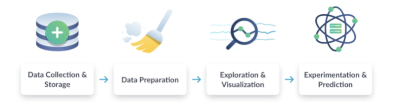
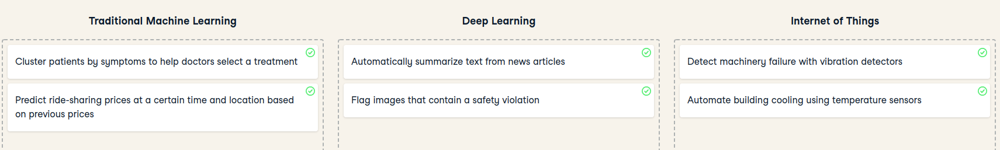
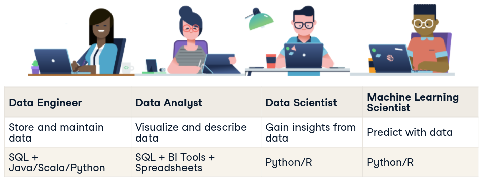
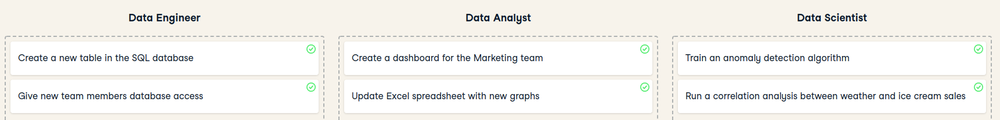

# Data Science For Everyone

# Introduction
## What can data do ?

- Describe the current state of an organization or process
- Detect anomalous events
- Diagnose the causes of events and behaviors
- Predict future events

## Data Science Workflow

1. **Data Collection & Storage** (Surveys, web traffic results, social media post, financial transactions, etc.)
2. **Data preparation** (Cleaning Data = Find missing or duplicate values, converting data into a more organized format)
3. **Exploration & Visualization** (Dashboards)
4. **Experimentation & Prediction**

## Machine Learning vs Internet of Things vs Deep Learning

## Data Science Roles
### Data Engineer (Data Collection & Storage)

- Information architects
- Build data pipelines and storage solutions
- Maintain data access

#### Tools

- SQL
    - To store and organize data
- Java, Scala or Python
    - Programming languages to process data
- Cloud computing
    - AWS, Azure, Google Cloud

### Data Analyst (Data Preparation, Exploration & Visualization)

- Perform simpler analyses that describe data
- Create reports and dashboards to summarize data
- Clean data for analysis
#### Tools
- SQL
  - Retrieve and aggregate data
- Spreadsheets
- BI Tools (Tableau, Power BI, Looker)
  - Dashboards and visualizations
- Python or R
  - Clean and analyze data

### Data scientist (Experimentation)
- Versed in statistical methods
- Run experiments and analyses for insights
- Traditional machine learning
- 
#### Tools
- SQL
  - Retrive and aggregate data
- Python and/or R
  - Science libraries as `pandas`(Python) and `tidyverse` (R)

### Machine Learning Scientist (Experimentation)
- Predictions and extrapolations
- Classification
- Deep learning
  - Image processing
  - Natural Language processing
  - 
#### Tools
- Python and R
- Machine learning libraries as Tensor Flow or Spark.

  