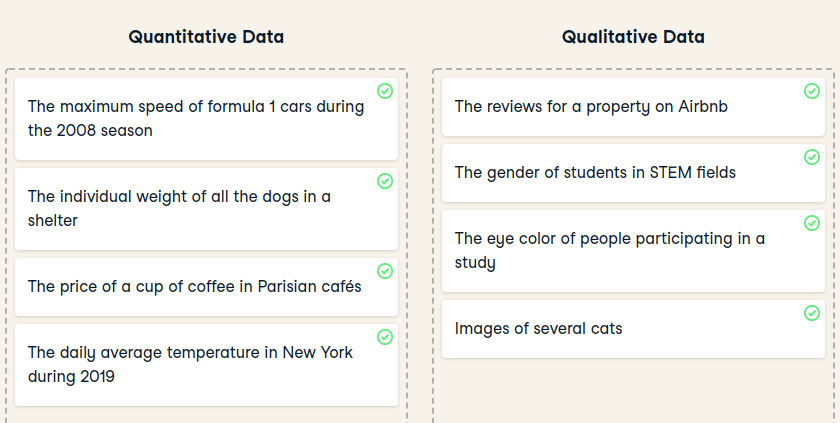
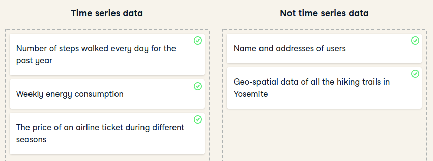

# Data Science For Everyone

# Introduction

## What can data do ?

- Describe the current state of an organization or process
- Detect anomalous events
- Diagnose the causes of events and behaviors
- Predict future events

## Data Science Workflow

1. **Data Collection & Storage** (Surveys, web traffic results, social media post, financial transactions, etc.)
2. **Data preparation** (Cleaning Data = Find missing or duplicate values, converting data into a more organized format)
3. **Exploration & Visualization** (Dashboards)
4. **Experimentation & Prediction**

## Machine Learning vs Internet of Things vs Deep Learning

## Data Science Roles

### Data Engineer (Data Collection & Storage)

- Information architects
- Build data pipelines and storage solutions
- Maintain data access

#### Tools

- SQL
    - To store and organize data
- Java, Scala or Python
    - Programming languages to process data
- Cloud computing
    - AWS, Azure, Google Cloud

### Data Analyst (Data Preparation, Exploration & Visualization)

- Perform simpler analyses that describe data
- Create reports and dashboards to summarize data
- Clean data for analysis

#### Tools

- SQL
    - Retrieve and aggregate data
- Spreadsheets
- BI Tools (Tableau, Power BI, Looker)
    - Dashboards and visualizations
- Python or R
    - Clean and analyze data

### Data scientist (Experimentation)

- Versed in statistical methods
- Run experiments and analyses for insights
- Traditional machine learning
-

#### Tools

- SQL
    - Retrive and aggregate data
- Python and/or R
    - Science libraries as `pandas`(Python) and `tidyverse` (R)

### Machine Learning Scientist (Experimentation)

- Predictions and extrapolations
- Classification
- Deep learning
    - Image processing
    - Natural Language processing
    -

#### Tools

- Python and R
- Machine learning libraries as Tensor Flow or Spark.

# Data Collection & Storage

## Source Data

- Company data
    - Web events
    - Survey data
    - Customer data
    - Logistic Data
    - Financial transactions

- Open Data
    - Data API's
    - Public records
        - Government agencies
        - National statistical offices
        - International organizations

## Data Types

- Quantitative data
    - Deals with numbers
    - Data can be measured

- Qualitative data
    - Deals with descriptions
    - Data can be observet but not measured
- Other data
    - Image data
    - Text data
    - Geospatial data
    - Network data

## Data storage and retrieval

Type of data storage:

- Unstructured
    - Email
    - Text
    - Video and audio files
    - Web pages
    - Social media
    - Document Database (NoSQL)
- Tabular
    - Relational Database (SQL)

## Data Pipelines

- Extract
- Transform
- Load

# Data Preparation

- Clean Data
- Simplify Data
- Remove duplicates
- Unique ID
- Homogeneity
- Data Types
- Missing Values
    - Impute
    - Drop
    - Keep

# Exploration Data Analysis

- Mean and variance for x
- Mean and variance for y
- Correlation coefficient
- Identical linear regression equation

- Know your data types
- Preview your data
- Descriptive statistics
- Visualize
- Outliers

# Interactive Dashboards

- Use color purposefully
- Color palettes
- Labels = Title, X axis label, Y axis label and legend.

## BI Tools

- Tableau
- Looker
- Power BI
- Grafana

# Time series forecasting

Time series it is a series of data points sequenced by time. For example: Stock prices, gas prices, etc.

- Seasonality in time series (Winter,Autumn,Summer,Spring)
